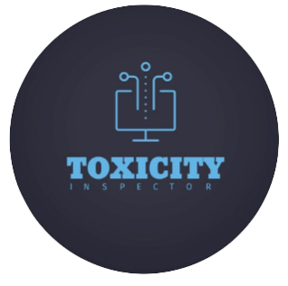

<!-- PROJECT LOGO -->
<br />
<div align="center">
  
  <a href="https://github.com/4lena/2022-GP2-2">
    
  </a>

  <h3 align="center">Toxicity Inspector</h3>
</div>

<!-- TABLE OF CONTENTS -->
<details>
  <summary>Table of Contents</summary>
  <ol>
    <li>
      <a href="#about-the-project">About The Project</a>
    </li>
    <li>
      <a href="#built-with">Built With</a></li>
    <li>
      <a href="#getting-started">Getting Started</a>
      <ul>
        <li><a href="#prerequisites">Prerequisites</a></li>
        <li><a href="#installation">Installation</a></li>
      </ul>
    </li>
    <li>
      <a href="#comments-csv-files-for-testing">Comments .CSV Files for Testing</a>
    </li>
    <li>
      <a href="#a-hosted-version">A Hosted Version</a>
    </li>
  </ol>
</details>

<!-- introduction -->
## About The Project

Most of today's toxicity detection tools do not produce accurate results due to the absence of users' feedback and that is 
why we come up with the idea of Toxicity Inspector. Toxicity Inceptor is a web-based application that inspects the overall 
toxicity level of the comments as well as for other many features. It also uses the advantages of users' feedback to provide 
an accurate result. The main goal of the Toxicity Inceptor is to provide accurate, reliable toxicity detection to those people 
who want to inspect the toxicity level of their comments. 

<!-- technology -->
## Built With

* [](https://skills.thijs.gg)
* [](https://skills.thijs.gg)
* [](https://skills.thijs.gg)


<!-- GETTING STARTED -->
## Getting Started

### Prerequisites

* MongoDB.
* LDA packages.
* Perspective API.
* Visual Studio Code.
* Spyder in Anaconda.
* Localhost server you can use MAMP local server.

### Installation

1. Install the Toxicity Inspector files and store them in your localhost directory.
2. In the Db.php file connect the MongoDB database using your username and password.
   ```sh
   $client = new MongoDB\Client(
    'your connection should be written here'
   );
   ```
3. Run all the Python files in Spyder make sure to edit the directories and to download the required modules <br>to download the modules paste the following code in the terminal:
   ```sh
   pip install module name
   ```
4. Edit the directories of the Python connection code in the following PHP files:
* overallToxicity.php
* InspectData.php
* UploadedFileForm.php
* Reclassify.py
* interpretationOfaComment.py
* comparison.py
<br>**For example** edit the following code to match your directory:
   ```sh
   $command = escapeshellcmd('write your directory here  API.py "'.$UploadedFile.'" "'.$fileID.'"');
   ```
5. Edit the directories of the following Python files:
* API.py
* APIar.py
* InspectData.py
* split.py
* splitAPI.py
* langDetection.py
* IntereptToxicity.py
* HateSpeechDetection.py
* Advanced.py
* AdvancedFeedback.py
* BaseLine.py
* BaseLineFeedback.py
* scores.py
* scoresFeedback.py
* Reclassification.py
<br>**For example** edit the first line of the python code to match the directory of your environment:
   ```sh
   #!write your environment directory here
   ```
6. Finally, run the files using your localhost server.

<!-- Comments CSV Files for Testing -->
## Comments .CSV Files for Testing
* [English file](https://drive.google.com/file/d/1E3dM9J89ZZbtWJvvb4wWs2JP4SlCSqLP/view).
* [Arabic file](https://drive.google.com/file/d/1IK6IlX_9vSnG746Ethv_OWcZpiVWX87h/view).

<!-- A Hosted Version  -->
## A Hosted Version 
[Toxicity Inspector Website](http://toxicityinspect.com/index.php).


